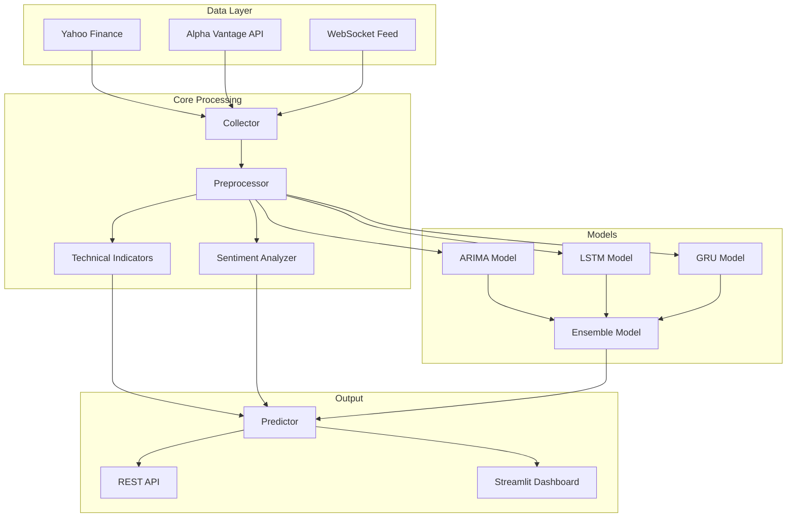

# Pythia Stock Predictor

[](https://www.python.org/)
[](https://opensource.org/licenses/MIT)
[](https://github.com/Mask3dCoder/pythia-stock-predictor/actions)
[](https://github.com/Mask3dCoder/pythia-stock-predictor)

A professional-grade CLI tool for stock market prediction using machine learning algorithms. Predict stock prices using ARIMA, LSTM, GRU, and ensemble models with sentiment analysis integration.

## Overview

Pythia Stock Predictor is a comprehensive stock market prediction system that combines multiple machine learning approaches with technical indicators and sentiment analysis to provide accurate stock price predictions. The project supports both historical data analysis and real-time predictions through a REST API.

## Features

### Core Capabilities
- **Multiple ML Models**: ARIMA, LSTM, GRU, and Ensemble predictions
- **Technical Indicators**: SMA, EMA, RSI, MACD, Bollinger Bands
- **Sentiment Analysis**: VADER and TextBlob for news sentiment
- **REST API**: FastAPI-based prediction service
- **Interactive Dashboard**: Streamlit-powered visualization

### Data Collection
- Historical stock data from Yahoo Finance
- Alpha Vantage API integration for real-time data
- WebSocket support for live updates

### Visualization
- Interactive candlestick charts
- Technical indicator plots
- Sentiment analysis visualization
- Prediction comparison graphs

## Architecture

<details>
<summary>Click to view Architecture Diagram</summary>



</details>

## Prerequisites

- **Python**: 3.9 or higher
- **TensorFlow** (optional): For LSTM/GRU models
- **pip**: Latest version recommended

## Installation

### 1. Clone the Repository

```bash
git clone https://github.com/Mask3dCoder/pythia-stock-predictor.git
cd pythia-stock-predictor
```

### 2. Create Virtual Environment

```bash
# Create virtual environment
python -m venv venv

# Activate on Windows
venv\Scripts\activate

# Activate on macOS/Linux
source venv/bin/activate
```

### 3. Install Dependencies

```bash
pip install -r requirements.txt
```

### 4. Configure Environment Variables

Copy the example environment file and configure your API keys:

```bash
copy .env.example .env
```

Edit `.env` and add your API keys:

```env
# Alpha Vantage API Key (get free key at https://www.alphavantage.co/support/#api-key)
ALPHA_VANTAGE_API_KEY=your_key_here

# API Key for securing the prediction API
API_KEY=your_secure_api_key_here
```

> **⚠️ Important**: Never commit your `.env` file to version control. It's already in `.gitignore` to prevent accidental exposure.

## Usage Examples

### CLI Commands

#### Collect Historical Data

```bash
# Collect 5 years of AAPL data
python main.py collect --symbol AAPL --years 5

# Collect data with specific interval
python main.py collect --symbol NVDA --years 3 --interval 1d
```

#### Train Models

```bash
# Train LSTM model
python main.py train --symbol AAPL --model lstm

# Train ARIMA model
python main.py train --symbol AAPL --model arima

# Train GRU model
python main.py train --symbol AAPL --model gru

# Train ensemble model
python main.py train --symbol AAPL --model ensemble
```

#### Make Predictions

```bash
# Predict next 30 days
python main.py predict --symbol AAPL

# Predict with specific model
python main.py predict --symbol AAPL --model ensemble --days 60
```

#### Run Dashboard

```bash
# Launch interactive dashboard
python main.py dashboard
```

### REST API Usage

#### Start the API Server

```bash
# Run API server on default port (8000)
python -m src.api.server

# Run with custom port
python -m src.api.server --port 8080
```

#### API Endpoints

```bash
# Health check
curl http://localhost:8000/health

# Make prediction (include API key header)
curl -X POST http://localhost:8000/predict \
  -H "X-API-Key: your_secure_api_key_here" \
  -H "Content-Type: application/json" \
  -d '{"symbol": "AAPL", "days": 30}'

# Get model info
curl -X GET http://localhost:8000/models/info \
  -H "X-API-Key: your_secure_api_key_here"
```

### Dashboard

Launch the interactive dashboard for visual analysis:

```bash
python main.py dashboard
```

The dashboard provides:
- Stock price visualization with candlestick charts
- Technical indicator overlays
- Sentiment analysis display
- Prediction vs actual comparison

## Testing

Run the complete test suite:

```bash
# Run all tests with coverage
pytest --cov=src --cov-report=html

# Run specific test file
pytest tests/test_predictor.py

# Run with verbose output
pytest -v
```

All 28 tests must pass before contributing.

## Project Structure

```
pythia-stock-predictor/
├── .github/
│   └── workflows/          # CI/CD pipelines
├── src/
│   ├── api/
│   │   └── server.py        # FastAPI server
│   ├── data/
│   │   ├── collector.py    # Data collection
│   │   └── preprocessor.py  # Data preprocessing
│   ├── models/
│   │   ├── arima_model.py   # ARIMA implementation
│   │   ├── lstm_model.py   # LSTM implementation
│   │   ├── gru_model.py    # GRU implementation
│   │   ├── ensemble_model.py  # Ensemble predictions
│   │   └── predictor.py    # Main predictor
│   ├── sentiment/
│   │   └── analyzer.py     # Sentiment analysis
│   └── visualization/
│       ├── dashboard.py    # Streamlit dashboard
│       └── plots.py        # Plotting utilities
├── tests/                   # Test suite
├── config.yaml            # Configuration
├── main.py                # CLI entry point
├── app.py                 # Application entry
├── requirements.txt       # Dependencies
├── .env.example          # Environment template
├── .gitignore            # Git ignore rules
├── LICENSE               # MIT License
├── README.md             # This file
├── CONTRIBUTING.md       # Contribution guidelines
└── CHANGELOG.md         # Version history
```

## Configuration

All settings are managed through `config.yaml`. Key sections include:

- **Data Collection**: Yahoo Finance and Alpha Vantage settings
- **Models**: ARIMA, LSTM, GRU, and ensemble configurations
- **Technical Indicators**: Indicator parameters
- **Sentiment Analysis**: VADER and TextBlob settings
- **API**: Server configuration
- **Dashboard**: Visualization settings

## Contributing

Contributions are welcome! Please read our [CONTRIBUTING.md](CONTRIBUTING.md) for guidelines.

### Quick Start

1. Fork the repository
2. Create a feature branch: `git checkout -b feature/amazing-feature`
3. Run tests to ensure everything passes
4. Commit your changes: `git commit -m 'Add amazing feature'`
5. Push to the branch: `git push origin feature/amazing-feature`
6. Open a Pull Request

## License

This project is licensed under the MIT License - see the [LICENSE](LICENSE) file for details.

## Acknowledgments

- Yahoo Finance for historical data
- Alpha Vantage for real-time data
- TensorFlow/Keras for deep learning models
- Statsmodels for ARIMA implementation

## Support

- Open an issue for bugs or feature requests
- Check the wiki for detailed documentation
- Join discussions in the GitHub community

---

<div align="center">

**Pythia Stock Predictor** © 2026

by [Mask3dCoder](https://github.com/Mask3dCoder)

</div>
